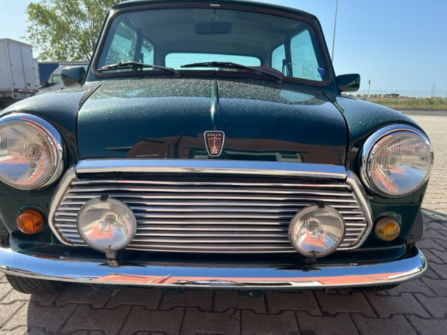

# <Portfolio Page based on Challenge 2>

## Description

Portfolio page made in HTML and CSS at the moment

- Will add JavaScript soon.
- Will fix About me section with new avatar, background photo and about me message.
- Will add projects when they are finished.
- Will test in different devices and views.

## Table of Contents 

- Title bar with shortcuts and my name.
- About me Bar.
- Work samples.
- Footer with contact information.
- Added Group Project files to Portfolio.

## Installation

N/A

## Links

Link to WebPage: https://cdennis27.github.io/PortfolioPageChallenge2/

Link to GitHub Repository: https://github.com/cdennis27/PortfolioPageChallenge2

## Usage

Picture retrieved from my personal work.

### Credits

Thanks to this Bootcamp contributors! I really appreciate the help and instruction!

### License

MIT License

Copyright (c) 2022 cdennis27

Permission is hereby granted, free of charge, to any person obtaining a copy
of this software and associated documentation files (the "Software"), to deal
in the Software without restriction, including without limitation the rights
to use, copy, modify, merge, publish, distribute, sublicense, and/or sell
copies of the Software, and to permit persons to whom the Software is
furnished to do so, subject to the following conditions:

The above copyright notice and this permission notice shall be included in all
copies or substantial portions of the Software.

THE SOFTWARE IS PROVIDED "AS IS", WITHOUT WARRANTY OF ANY KIND, EXPRESS OR
IMPLIED, INCLUDING BUT NOT LIMITED TO THE WARRANTIES OF MERCHANTABILITY,
FITNESS FOR A PARTICULAR PURPOSE AND NONINFRINGEMENT. IN NO EVENT SHALL THE
AUTHORS OR COPYRIGHT HOLDERS BE LIABLE FOR ANY CLAIM, DAMAGES OR OTHER
LIABILITY, WHETHER IN AN ACTION OF CONTRACT, TORT OR OTHERWISE, ARISING FROM,
OUT OF OR IN CONNECTION WITH THE SOFTWARE OR THE USE OR OTHER DEALINGS IN THE
SOFTWARE.

---END

